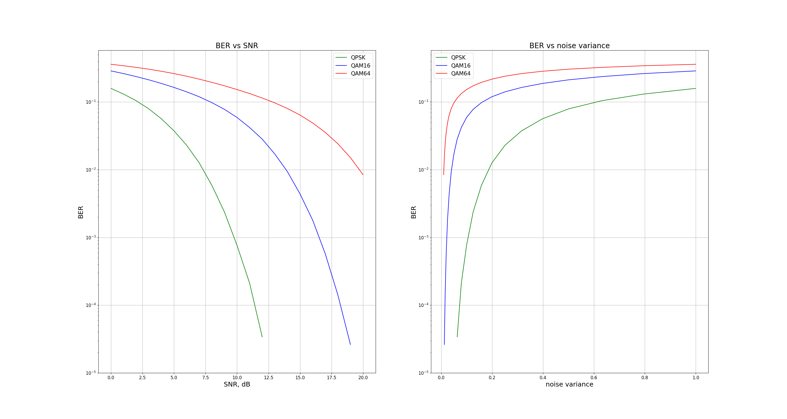
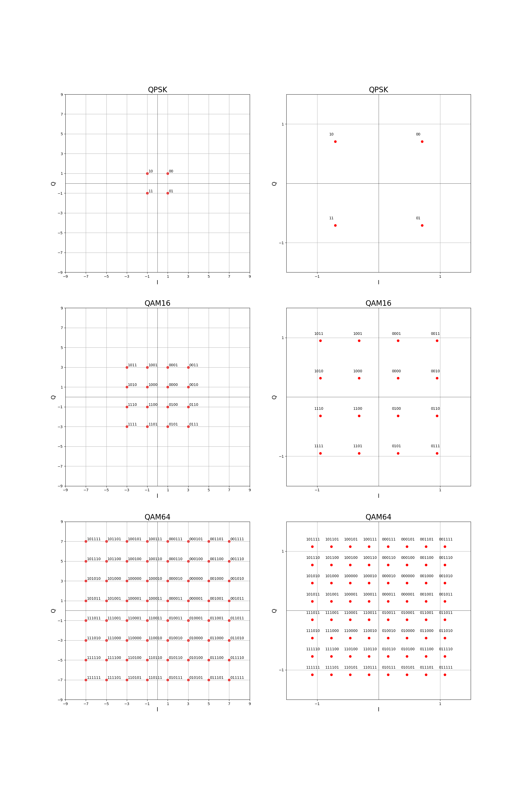

# QAM Modulator BER Analysis

Проект моделирует цифровую систему связи с модуляциями **QPSK**, **QAM16** и **QAM64** при передаче сигнала через канал с **AWGN** и сравнивает качество приёма по метрике **BER** для разных значений **SNR**.

## Структура репозитория

```text
.
├── modulation_analyzer.py
├── plot_ber.py
├── qam_modulator.cpp
├── qam_modulator.exe
├── requirements.txt
├── ber_vs_snr_and_variance.png
└── .gitignore
```

## Назначение файлов

### `qam_modulator.cpp`

Вычислительный модуль проекта на C++.

Содержит:

- `AWGNAdder` - класс выполняющий функциональность добавления гауссовского шума к созвездию QAM;
- `ModulatorGrey` - класс выполняющий функциональность модулятора QAM (QPSK, QAM16, QAM64) с кодом Грея;
- `DemodulatorGrey` - класс выполняющий функциональность демодулятора QAM (QPSK, QAM16, QAM64);
- `generate_bits_vector` - генерацию случайного битового вектора;
- `compute_ber` - расчёт **BER**;

По умолчанию программа перебирает значения **SNR** от `0` до `20 dB` с шагом `1 dB`.
Для каждого значения SNR генерируется `bits_per_symbol * 1_000_000` бит.
Данные генерации сохраняются в CSV-файлы.

### `modulation_analyzer.py`

Основной Python-сценарий для запуска эксперимента.

Скрипт:

- запрашивает у пользователя список модуляций;
- проверяет, что введены только поддерживаемые типы: `QPSK`, `QAM16`, `QAM64`;
- запускает бинарник модуля C++ `qam_modulator.exe`;
- строит графики по полученным CSV-файлам;
- сохраняет итоговое изображение в `ber_vs_snr_and_variance.png`.

Пример ввода:

```text
QPSK, QAM16, QAM64
```

### `plot_ber.py`

Модуль визуализации результатов (графики **BER vs SNR** и **BER vs noise variance**).



### `constellations_with_Gray.py`

Модуль визуализации сигнальных созвездий (нормированных и нет) для типов модуляции `QPSK`, `QAM16`, `QAM64` с кодом Грея.



### `requirements.txt`

Файл с Python-зависимостями.

Сейчас проект использует:

- `matplotlib==3.10.9`.

### `qam_modulator.exe`

Скомпилированная версия C++ модуля.

Файл собран под Windows.

## Математическое описание модуляции

Зададим отображение битового вектора $\vec{b}$ в вектор модуляционных символов $\vec{\alpha}$:

$$
\vec{\alpha} = F(\vec{b})
$$

Данное отображение может быть описано следующим образом:

$$
\alpha_k = b_0x_0 + b_2x_1 + \ldots + b_0b_4x_{m+2} + \ldots + b_0b_2b_4x_{m^2 + 1} + \ldots + x_{\sqrt{M} - 1}, \quad k = 0 \ \ldots \ \sqrt{M} - 1
$$

где чётность порядка битов из битового вектора будем выбирать исходя из компоненты модуляционного символа: I (`In-phase`) или Q (`Quadrature`).

Компоненты вектора $\vec{\alpha}$ вычисляются следующим образом:

$$
\alpha_k = -\sqrt{M} + 1 + 2 \cdot k
$$

Перепишем отображение в матричном виде:

$$
B_I \cdot \vec{x} = \vec{\alpha}_{I} \quad \Rightarrow \quad \vec{x} = B^{-1}_I \vec{\alpha}_{I}
$$

где $B_I$ - матрица, состаящая из битовых комбинаций.

Рассмотрим пример данного отображения для модуляции `QPSK` ($M=4$):

$$
\alpha_0 = b_0x_0 + x_1, \quad \alpha_1 = b_1x_0 + x_1
$$

Компоненты вектора $\vec{x}$ найдём из следующего уравнение:

$$
\left(\begin{array}{cc}
1 & 1 \\
0 & 1
\end{array}\right) \cdot \left(\begin{array}{c}
x_0 \\
x_1
\end{array}\right) = \left(\begin{array}{c}
-1 \\
1
\end{array}\right) \quad \Rightarrow \quad \left(\begin{array}{c}
x_0 \\
x_1
\end{array}\right) = \left(\begin{array}{cc}
1 & -1 \\
0 & 1
\end{array}\right) \cdot \left(\begin{array}{c}
-1 \\
1
\end{array}\right) \quad \Rightarrow \quad \left(\begin{array}{c}
x_0 \\
x_1
\end{array}\right) = \left(\begin{array}{c}
-2 \\
1
\end{array}\right)
$$

Получили следующее отображение:

$$
\begin{cases}
I = -2 \cdot b_0 + 1 \\
Q = -2 \cdot b_1 + 1
\end{cases}
$$

Для QAM-модуляций размером $M$ матрица $B$ будет иметь размер $\sqrt{M} \times \sqrt{M}$.
Столбцы данной матрицы как раз будут заполняться в начале комбинациями битов $b_0, b_2, \ldots$ с учётом кодировки Грея, а далее результатами операции логической "И" $b_0b_2$ или, что то же самое, произведение.

Найдём $\vec{x}$ для `QAM16`:

$$
\left(\begin{array}{cccc}
1 & 1 & 1 & 1 \\
1 & 0 & 0 & 1 \\
0 & 0 & 0 & 1 \\
0 & 1 & 0 & 1
\end{array}\right) \cdot \left(\begin{array}{c}
x_0 \\
x_1 \\
x_2 \\
x_3
\end{array}\right) = \left(\begin{array}{c}
-3 \\
-1 \\
1 \\
3
\end{array}\right) \quad \Rightarrow \quad \left(\begin{array}{c}
x_0 \\
x_1 \\
x_2 \\
x_3
\end{array}\right) = \left(\begin{array}{cccc}
0 & 1 & -1 & 0 \\
0 & 0 & -1 & 1 \\
1 & -1 & 1 & -1 \\
0 & 0 & 1 & 0
\end{array}\right) \cdot \left(\begin{array}{c}
-3 \\
-1 \\
1 \\
3
\end{array}\right) \quad \Rightarrow \quad \left(\begin{array}{c}
x_0 \\
x_1 \\
x_2 \\
x_3
\end{array}\right) = \left(\begin{array}{c}
-2 \\
2 \\
-4 \\
1
\end{array}\right)
$$

Получили следующее отображение:

$$
\begin{cases}
I = -2 \cdot b_0 + 2 \cdot b_2 -4 \cdot b_0b_2 + 1 \\
Q = -2 \cdot b_1 + 2 \cdot b_3 -4 \cdot b_1b_3 + 1
\end{cases}
$$

Найдём $\vec{x}$ для `QAM64`:

$$
\left(\begin{array}{cccccccc}
1 & 1 & 1 & 1 & 1 & 1 & 1 & 1 \\
1 & 1 & 0 & 1 & 0 & 0 & 0 & 1 \\
1 & 0 & 0 & 0 & 0 & 0 & 0 & 1 \\
1 & 0 & 1 & 0 & 0 & 1 & 0 & 1 \\
0 & 0 & 1 & 0 & 0 & 0 & 0 & 1 \\
0 & 0 & 0 & 0 & 0 & 0 & 0 & 1 \\
0 & 1 & 0 & 0 & 0 & 0 & 0 & 1 \\
0 & 1 & 1 & 0 & 1 & 0 & 0 & 1
\end{array}\right) \cdot \left(\begin{array}{c}
x_0 \\
x_1 \\
x_2 \\
x_3 \\
x_4 \\
x_5 \\
x_6 \\
x_7
\end{array}\right) = \left(\begin{array}{c}
-7 \\
-5 \\
-3 \\
-1 \\
1 \\
3 \\
5 \\
7
\end{array}\right) \quad \Rightarrow
$$

$$
\Rightarrow \quad \left(\begin{array}{c}
x_0 \\
x_1 \\
x_2 \\
x_3 \\
x_4 \\
x_5 \\
x_6 \\
x_7
\end{array}\right)=
\left(\begin{array}{cccccccc}
0 & 0 & 1 & 0 & 0 & -1 & 0 & 0 \\
0 & 0 & 0 & 0 & 0 & -1 & 1 & 0 \\
0 & 0 & 0 & 0 & 1 & -1 & 0 & 0 \\
0 & 1 & -1 & 0 & 0 & 1 & -1 & 0 \\
0 & 0 & 0 & 0 & -1 & 1 & -1 & 1 \\
0 & 0 & -1 & 1 & -1 & 1 & 0 & 0 \\
1 & -1 & 1 & -1 & 1 & -1 & 1 & -1 \\
0 & 0 & 0 & 0 & 0 & 1 & 0 & 0
\end{array}\right) \cdot \left(\begin{array}{c}
-7 \\
-5 \\
-3 \\
-1 \\
1 \\
3 \\
5 \\
7
\end{array}\right) \quad \Rightarrow \quad
\left(\begin{array}{c}
x_0 \\
x_1 \\
x_2 \\
x_3 \\
x_4 \\
x_5 \\
x_6 \\
x_7
\end{array}\right) = \left(\begin{array}{c}
-6 \\
2 \\
-2 \\
-4 \\
4 \\
4 \\
-8 \\
3
\end{array}\right)
$$

Получили следующее отображение:

$$
\begin{cases}
I = -6 \cdot b_0 + 2 \cdot b_2 - 2 \cdot b_4 -4 \cdot b_0b_2 + 4 \cdot b_2b_4 + 4 \cdot b_0b_4 - 8 \cdot b_0b_2b_4 + 3 \\
Q = -6 \cdot b_1 + 2 \cdot b_3 - 2 \cdot b_5 -4 \cdot b_1b_3 + 4 \cdot b_3b_5 + 4 \cdot b_1b_5 - 8 \cdot b_1b_3b_5 + 3
\end{cases}
$$
